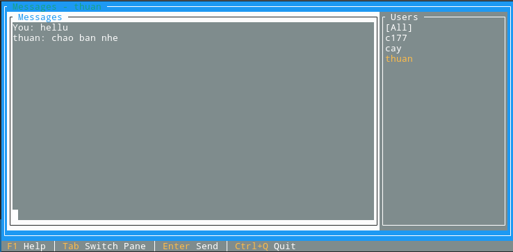

# Shype P2P Messaging System

<p align="center"></p>

A hybrid P2P messaging application similar to Skype that uses UDP (server assist) + UDP P2P for communication with a Terminal.Gui TUI client.

## Features

✅ Server-assisted peer discovery (UDP)  
✅ P2P messaging over UDP  
✅ Graceful fallback to P2P if server goes down  
✅ Terminal UI with user list, unread badges, and shortcuts  

## Requirements
- .NET 9.0 SDK
- Linux/macOS/Windows supported
- Linux only (Terminal UI): ncurses wide-character library
  - Ubuntu/Debian: `sudo apt-get update && sudo apt-get install -y libncursesw6`
  - Fedora/RHEL: `sudo dnf install -y ncurses-compat-libs`
  - Arch/Manjaro: `sudo pacman -S --needed ncurses`

If the TUI fails to start with an error like: Error loading native library "libncursesw.so.X", install the package above and re-run.

## How to Run

- Start the server (default port 8080):
```bash
 dotnet run --project "Shype Login Server UDP.csproj"
 # Choose option 1
```

- Start a client:
```bash
 dotnet run --project "Shype Login Server UDP.csproj"
 # Choose option 2, enter username, server address (default localhost)
```

TUI shortcuts: F1 Help, Tab Switch Pane, Enter Send, Esc All, Ctrl+Q Quit

## Troubleshooting
- TUI crash on Linux: install libncursesw as above. The client now detects this and exits gracefully with instructions.
- No peers: connect a second client to the same server; broadcast messages in [All] go to all peers.

## Project Structure
- Program.cs: menu to launch server or client
- Services/ShypeServer.cs: UDP server with user list broadcast
- Services/ShypeClient.cs: UDP P2P client with presence and chat
- Services/ChatUi.cs: Terminal.Gui-based client UI
- Models/: Message and User DTOs
